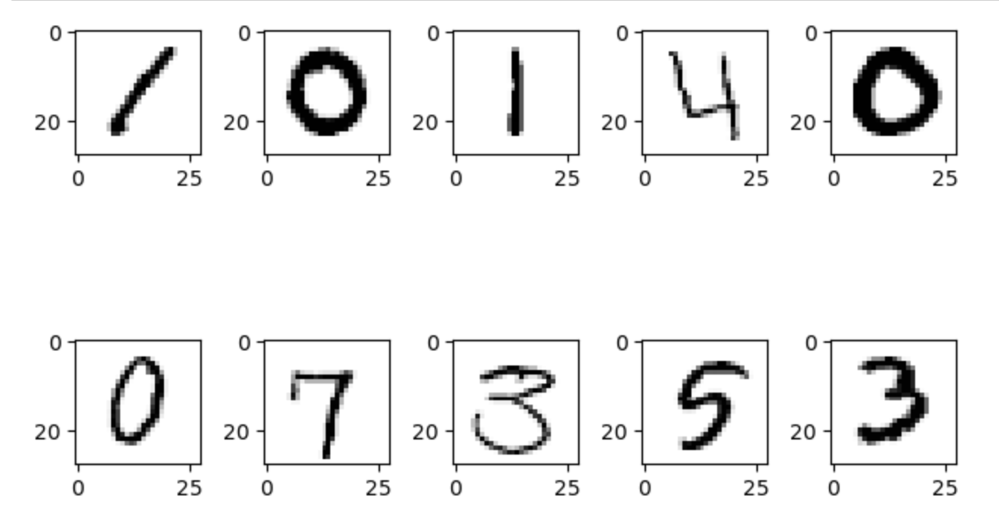

# MNIST

지금까지는 정형 데이터였다면, 이번엔 비정형 데이터를 공부해 봅시다. 비정형 데이터의 대표적인 예로는 이미지가 있습니다. 이미지 데이터 셋을 이용한 다중 분류 문제를 해결해 봅시다.

<code>MNIST</code>는 사람이 손 글씨로 쓴 숫자들을 모아놓은 데이터 셋입니다. 

```py
# 1. 모듈 임포트
import numpy as np # 넘파이
import pandas as pd # 판다스, csv 불러오기 위함
import matplotlib.pyplot as plt # 맷플롯핍, 이미지로 출력해보기 위함
```

```py
# 2. 로우 데이터 로딩
# 1) 불러오기
df = pd.read_csv('./data/mnist/train.csv')
# display(df, df.shape) # (42000, 785) -> 총 42000장과 785개의 컬럼

# 2) 이미지 데이터라 결측치와 이상치가 없음

# 3) 이미지 데이터
img_data = df.drop('label', axis=1, inplace=False).values # 맨 앞에 label만 날리면 나머지가 픽셀 데이터라, 이미지 데이터만 가질 수 있음
# display(img_data)

# 4) 그림으로 확인
fig = plt.figure()
fig_arr = []

# interpolation은 보간법을 뜻하며, 픽셀들의 축 위치 간격을 보정하여 이미지가 자연스러운 모양으로 보일 수 있게 하는 방법 
# imshow()에서는 16가지 보간법이 있고, 'nearest'는 가장 고해상도인 보간법임

for n in range(10):
    fig_arr.append(fig.add_subplot(2,5,n+1))
    fig_arr[n].imshow(img_data[n].reshape(28,28), cmap='Greys', interpolation='nearest')
    
plt.tight_layout()
plt.show()
```


