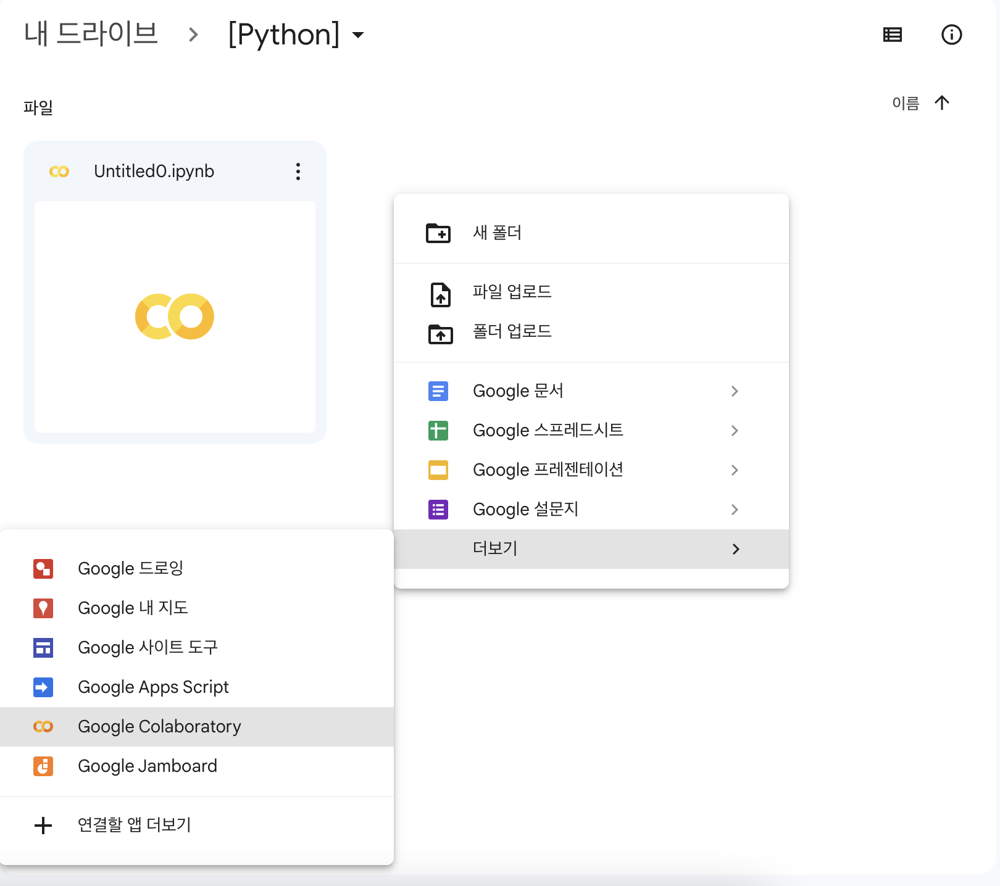

# 파이썬

## 특징

### 배우기 쉽다

문법이 간단합니다. 그래서 데이터 처리에도 많이 쓰이는 언어입니다. 물론 C언어와 자바로 가능합니다.

### 중괄호가 없다

들여쓰기로 블록을 구분합니다.

### 인터랙티브하게 실행이 가능

나눠서 본인이 원하는 부분까지 코드를 실행시킬 수 있습니다. 한 번에 코드를 실행하는 다른 언어와 다르게, 단계별 처리가 가능한 언어이기 때문에 데이터 처리하기에 매우 좋습니다.

### 라이브러리가 많다

### 파이썬 버전

파이썬 버전은 버전 2와 3 두 가지가 있습니다. 해당 수업에서는 버전 3으로 진행합니다. 두 가지 버전은 많은 차이가 존재하기 때문에 검색 시 유의해 코드를 작성해야 합니다.

## 문법

### 출력

```python
print('Hello world')
```

문자열을 출력할 때 싱글 쿼테이션을 사용하고, 세미콜론이 없어도 됩니다. 이런 점에서 자바보다 자바스크립트와 유사하단 걸 알 수 있습니다.

### 주석

```python
# # 한 줄 주석
# ''' 여러 줄 주석 ''' 
```

### 변수
```python
# 변수 생성 
a = 100
a = 3.14
a = '안녕'

# 변수 삭제
del a
# 단 변수 삭제는 지양함
# 프로그램에 오류를 야기할 수 있기 때문
# 가비지 컬렉터가 알아서 처리해 줌
```

### 데이터 타입

파이썬의 데이터 타입은 범주로 나눕니다.

#### 1. Numeric

#### 2. Sequence

#### 3. Text Sequence

#### 4. Mapping

#### 5. Set

#### 6. Bool

### Numeric

```python
# 1. [Numeric]
# 정수와 실수
a = 123               # 정수
b = 3.14159265358979  # 실수

print(type(a))  # int
print(type(b))  # float

result = 3 / 4  # [자바] 0
print(result)   # [파이썬] 0.75
```

### Sequence

시퀀스는 세 가지가 있습니다. <code>List</code>, <code>Tuple</code>, <code>Range</code>

#### List
> 객체를 순서대로 저장하는 집합형 자료구조

```python
# 리스트 예제

myList = list()         # 요소가 없는 list 객체 생성
myList = [1, 3.14, 100] # literal로 표현
print(myList)           # [1, 3.14, 100]

# 중첩 리스트도 가능
myList = [1, 2, 3, [3.14, 5.25, 100], 5, 6]

# 출력
print(myList)       # [1, 2, 3, [3.14, 5.25, 100], 5, 6]
print(myList[0])    # 1
print(myList[-1])   # 6
                    # 인덱싱에 '-'가 있으면 뒤에서부터 계산
print(myList[3][2]) # 100
```

```python
# 슬라이스
# 슬라이스는 잘라도 원본과 결과본의 데이터 타입이 같다
# 소시지를 반으로 잘라도 소시지인 것처럼

print(myList[0:2])  # [1, 2]
                    # 슬라이싱에 앞은 포함, 뒤는 불포함

print(myList[0:1])  # [1]
                    # 얘는 당연히 1이 나올 것인데,
                    # 리스트이니까 [1]로 출력됨

print(myList[1:])   # [2, 3, [3.14, 5.25, 100], 5, 6]
                    # 1 이후로 전체 출력

print(myList[:2])   # [1, 2]
                    # 위와 반대

print(myList[:])    # [1, 2, 3, [3.14, 5.25, 100], 5, 6]
                    # 복사할 때 사용
```

```python
# 리스트 연산

a = [1, 2, 3]
b = [4, 5, 6]
c = a + b

print(c)  # [1, 2, 3, 4, 5, 6]
          # 파이썬은 벡터 연산이 안 됨
          # 즉 [5, 7, 9]가 나오는 게 아니라
          # 위처럼 리스트가 연결된 값이 출력

c = a * 3
print(c)  # 마찬가지로 [3, 6, 9]가 아니라
          # [1, 2, 3, 1, 2, 3, 1, 2, 3]이 출력
```

```python
# 리스트는 객체
# 즉 많은 메소드를 가지고 있다

a = [1, 2, 3]
a.append(4)
print(a)  # [1, 2, 3, 4]

a.append([4, 5])
print(a)  # [1, 2, 3, 4, [4, 5]]
```

#### Tuple

리스트와 똑같음

단 read only

# 파이썬 개발 환경

기존 자바는 JDK를 설치하고 이클립스나 인텔리제이, STS 개발 툴을 설치해 사용했습니다. 이는 파이썬도 마찬가지입니다. 파이썬은 파이참(<code>pycharm</code>)과 장고(<code>Django</code>)를 사용해 개발합니다.

## 주피터 노트북

현재 수업에서는 주피터 노트북(<code>Jupyter Notebook</code>)이란 웹 기반의 개발 툴을 사용해 개발합니다. 이를 사용해 데이터 분석과 머신러닝, 딥러닝을 할 계획입니다. 

## 코랩

주피터 노트북을 사용하는 방법은 두 가지가 있습니다. 로컬에 설정하거나 코랩(<code>CoLab</code>)이라는 클라우드 기분 주피터 노트북 환경을 사용합니다. 현재 수업에서는 처음에는 로컬에 설정해 개발을 하다 이후 코랩을 이용해 주피터 노트북을 사용할 예정입니다.

### 생성

구글 드라이브 접속 후 폴더 안에서 우클릭 후 더 보기, <code>Google Colaboratory</code> 클릭해 생성해 줍니다.



### 셀(Cell)

코드를 작성하는 박스를 <code>Cell</code>이라고 합니다. 


### 코드 실행

<code>Cell</code>을 실행하려면 <code>Ctrl + Enter</code>로 실행합니다.


### 단축키

```python
# 코드 셀 위에 삽입
  # Command + M + A
# 코드 셀 아래에 삽입
  # Command + M + B
# 코드 셀 삭제
  # Command + M + D

# 실행 후 커서 해당 셀
  # Command + Enter
# 실행 후 커서 다음 셀
  # Shift + Enter
```

### 메모리 공유


## 아나콘다 플랫폼

### base

base라는 가상 곤간이 있음 A는 웹 개발을 하고, B는 데이터 분석, C라는 공간에는 AI, ML, DL 등을 작업할 수 있습니다.

### 환경 설정

아래 3개의 라이브러리와 1개의 개발 환경을 설치해야 합니다.

- 라이브러리
  - Numpy
  - Pandas
  - Matplotlib
- 개발 환경
  - nb_conda

```bash
# conda는 아나콘다 명령어

# 설치
conda create -n data_env python=3.8 opensslcon

# 이동
conda activate data_env

# 넘파이 설치
conda install numpy

# 판다스 설치
conda install pandas

# 맷플롯립
conda install matplotlib

# NB콘다
conda install nb_conda
```


### 넘파이
> 다차원 배열을 사용하기 위한 라이브러리

실제로 우리가 사용하는 자료구조는 넘파이가 가지고 있는 <code>edarray</code>라는 다차원 배열입니다.

### Pandas

### Matplotlib