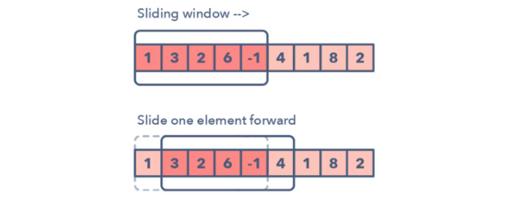

# 문제
https://www.acmicpc.net/problem/21921

# 코드
## 실패

```java
public class Main {
    public static void main(String[] args) throws IOException {
        BufferedReader br = new BufferedReader(new InputStreamReader(System.in));
        StringTokenizer st = new StringTokenizer(br.readLine());

        int n = Integer.parseInt(st.nextToken());
        int x = Integer.parseInt(st.nextToken());
        int[] today = new int[n];
        int check = 0;
        int max = 0;
        HashMap<Integer, Integer> map = new HashMap<>();

        st = new StringTokenizer(br.readLine());
        for (int i = 0; i < n; i++) {
            int el = Integer.parseInt(st.nextToken());
            today[i] = el;
            check += el;
        }

        if (check == 0) {
            System.out.println("SAD");
        } else {
            for (int i = 0; i < n - x + 1; i++) {
                int sum = 0;

                for (int j = i; j < i + x; j++) {
                    sum += today[j];
                }

                if (sum >= max) {
                    max = sum;
                    map.put(max, map.getOrDefault(max, 0) + 1);
                }
            }

            System.out.println(max);
            System.out.println(map.get(max));
        }
    }
}
```

중첩 루프를 돌아, 반복문이 돌 때마다 각각의 index에서 x만큼의 요소를 더합니다. 이렇게 하면 시간 복잡도가 O(n*x)으로 시간 초과가 발생하게 됩니다. 이를 슬라이딩 윈도우를 사용해 시간 복잡도를 O(n)으로 줄여 시간 초과를 해결할 수 있습니다.

## 성공(슬라이딩 윈도우)
```java
public class Main {
    public static void main(String[] args) throws IOException {
        BufferedReader br = new BufferedReader(new InputStreamReader(System.in));
        StringTokenizer st = new StringTokenizer(br.readLine());

        int n = Integer.parseInt(st.nextToken());
        int x = Integer.parseInt(st.nextToken());
        int[] today = new int[n];
        int check = 0;
        int max = 0;
        int cnt = 0;

        st = new StringTokenizer(br.readLine());
        for (int i = 0; i < n; i++) {
            int el = Integer.parseInt(st.nextToken());
            today[i] = el;
            check += el;    // 동시에 같이 체크해 주며,
                            // 모든 요소의 합을 구함
        }

        // 모든 요소가 0일 시, SAD 출력
        if (check == 0) {
            System.out.println("SAD");

        // 0이 아니라면 
        } else {
            int sum = 0;

            for (int i = 0; i < x; i++) {
                sum += today[i];    // 1부터 x까지 sum 변수에 더해주고
            }

            max = sum;  // max에 sum 할당 
            cnt = 1;    // cnt 1로 초기화

            // 옆으로 이동하며 더해주고
            for (int i = x; i < n; i++) {
                sum += today[i] - today[i - x];

                // 앞에 더한 값과 비교
                // 더 큰 수 발견 시
                if (sum > max) {
                    max = sum;  // 할당해 주고,
                    cnt = 1;    // cnt 1로 초기화
                } else if (sum == max){ 
                    cnt ++;     // 최댓값과 같다면 cnt 증가
                }
            }

            System.out.println(max);
            System.out.println(cnt);
        }
    }
}
```

이어 최댓값의 개수를 구하는 것도 기존 HashMap 사용에서 cnt 변수를 추가해서 값을 찾아줬습니다.

