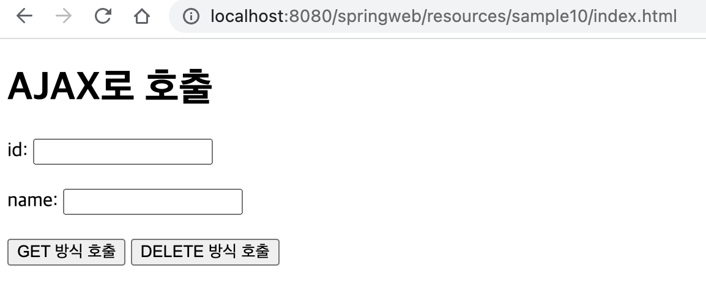

# REST 예제
> GET과 DELETE 비교 및 server.xml에 환경설정

### GET과 DELETE
```html
<!DOCTYPE html>
<html>
<head>
<meta charset="UTF-8">
<title>Insert title here</title>
<script src="https://code.jquery.com/jquery-2.2.4.js"
	integrity="sha256-iT6Q9iMJYuQiMWNd9lDyBUStIq/8PuOW33aOqmvFpqI="
	crossorigin="anonymous"></script>
<script>
	function myFunc(restMethod) {
		$.ajax({
			url : '/springweb/rest/user',
			method : restMethod,
			data : {
				id : $("#id").val(),
				name : $("#name").val()
			},
			success : function() {
				alert("성공");
				
			},
			error : function() {
				alert("실패");
			}
		})
	}
</script>
</head>

<body>
	<h1>AJAX로 호출</h1>

	id:
	<input type="text" id="id">

	<br>
	<br>

  name:
	<input type="text" id="name">

	<br>
	<br>

	<button onclick="myFunc('get')">GET 방식 호출</button>
	<button onclick="myFunc('delete')">DELETE 방식 호출</button>
</body>
</html>
```



아이디와 이름을 입력하고 <code>GET</code> 방식과 <code>DELETE</code> 방식으로 호출한 뒤 결과를 비교할 예정입니다.

```java
package my.spring.springweb.sample10;

import org.apache.logging.log4j.LogManager;
import org.apache.logging.log4j.Logger;
import org.springframework.http.ResponseEntity;
import org.springframework.web.bind.annotation.DeleteMapping;
import org.springframework.web.bind.annotation.GetMapping;
import org.springframework.web.bind.annotation.RequestMapping;
import org.springframework.web.bind.annotation.RestController;

@RestController
@RequestMapping(value = "/rest/user")
public class MyRestController {
	Logger log = LogManager.getLogger("case3");

	@GetMapping
	public ResponseEntity<?> method01(String id, String name) {
		log.debug("Get 방식 호출");
		// log.debug("Get 방식 호출" + " " + id + " " + name);
		return null;
	}

	@DeleteMapping
	public ResponseEntity<?> method02(String id, String name) {
    log.debug("Delete 방식 호출");
		// log.debug("Delete 방식 호출" + " " + id + " " + name);
		return null;
	}
}
```

### 호출 1: 입력 X


입력값이 없을 땐 정상적으로 호출이 되는 것처럼 보입니다.

### 호출 2: 입력 O, 실패
> id: id, name: name 입력


<code>GET</code>과 다르게 <code>DELETE</code> 호출은 <code>NULL</code>로 들어오는 것을 확인할 수 있습니다. 이는 <code>Request Body</code>에 들어오는 데이터를 <code>GET</code>과 <code>POST</code>의 경우 톰캣이 파싱을 해 주지만, <code>DELETE</code>와 <code>PUT</code>의 경우 톰캣이 기본적으로 파싱을 하고 있지 않기 때문입니다.

따라서 <code>server.xml</code>을 다음과 같이 수정하도록 하겠습니다.

### server.xml

```xml
<!-- server.xml -->

<!-- parseBodyMethods 속성 추가 -->
<Connector connectionTimeout="20000" port="8080" 
    parseBodyMethods="POST, PUT, DELETE" protocol="HTTP/1.1" redirectPort="8443"/>
```

### 호출 3: 입력 O, 성공

