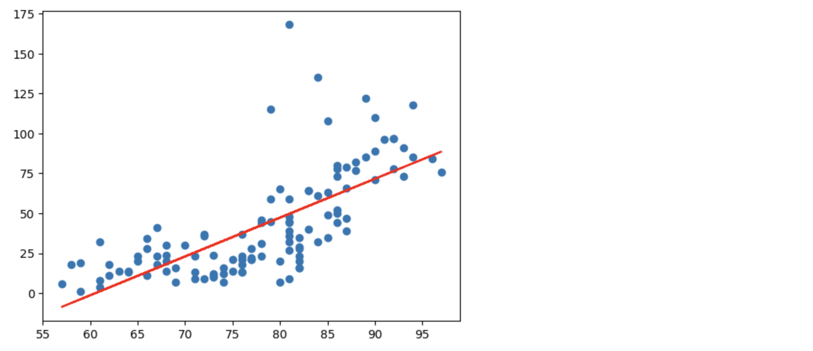

# Linear Regression 2
> 사이킷 런을 사용해 보자

사이킷 런(<code>sklearn</code>)은 파이썬 라이브러리로 다양한 머신러닝 모델, 데이터 전처리 기능, 모델 선택 및 평가 도구, 차원 축소, 클러스터링 등의 기능을 제공합니다.

## 사이킷 런 설치

```bash
conda install scikit-learn
```

## 사이킷 런 사용

```py
import numpy as np # 넘파이
import pandas as pd # 판다스
import matplotlib.pyplot as plt # 맷플롯립
from tensorflow.keras.models import Sequential # 박스
from tensorflow.keras.layers import Flatten, Dense # 인풋, 아웃풋 레이어
from tensorflow.keras.optimizers import SGD # 옵티마이저

from sklearn import linear_model # 사이킷 런

# 우리는 이미 x_data, t_data가 있으니 이를 사용하고
# 모델만 만들면 됨

# 1. 모델 생성
sklearn_model = linear_model.LinearRegression()

# 2. 학습 진행
sklearn_model.fit(x_data, t_data)

# 3. 예측
result_sklearn = sklearn_model.predict([[62]])
print(result_sklearn) # 3.58..

# 4. 눈으로 확인
# 산점도(scatter)와 직선(model)을 그리자
plt.scatter(x_data, t_data) 

weight = sklearn_model.coef_    # w
bias = sklearn_model.intercept_ # b

plt.plot(x_data, x_data*weight+bias, color='r') # x에 대한 예측치를 직선으로 
plt.show() # 아래 이미지 확인
```



